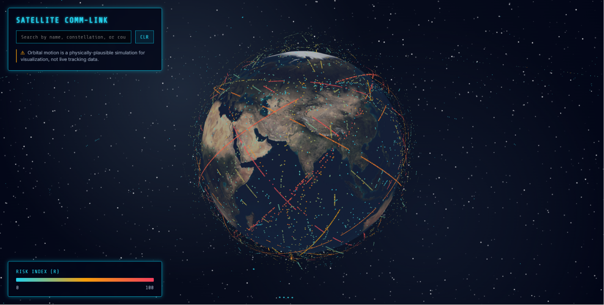

# Satellite Risk Index
  [](https://PriyanshKotadia.github.io/satellite-risk-index/)

Multi-Constellation Collision Risk Score Estimator — a spatial-temporal ML model estimating satellite conjunction risk in LEO.

## Live Demo
**Live demo: [https://PriyanshKotadia.github.io/satellite-risk-index/](https://PriyanshKotadia.github.io/satellite-risk-index/)**



## Model Performance
The final LightGBM model evaluated on the complete ~4.2M row dataset achieved highly accurate rank-ordering for risk triage:
- **Aggregate Spearman Correlation**: 0.9757
- **Aggregate RMSE**: 6.217 | **MAE**: 4.068
- *Note on Constellation Imbalance*: To catch potential overfitting to Starlink Gen 1 (which comprises ~67% of the catalog), performance was explicitly evaluated per-constellation. The model remains robust across the board (Starlink Spearman: 0.955, Other: 0.910), with OneWeb showing slightly lower correlation (0.804) due to its highly ordered orbital structure compressing variance.

## Features
- **Interactive 3D Globe**: GPU-accelerated visualization of 17,000+ satellites animated along physically-plausible simulated orbital paths.
- **Explainable AI (SHAP)**: Click any satellite to view its predicted congestion risk score and top 3 contributing factors.
- **Global Search**: Instantly search, filter, and highlight satellites by name, parent constellation, or country.
- **Mobile Responsive**: Dynamically caps the rendered object count on mobile devices to preserve frame rates while ensuring the highest-risk satellites remain visible.

## How It Works
The project predicts satellite conjunction risk using a full end-to-end data pipeline:
1. **Raw Data (CelesTrak)**: TLE-derived tracking data is loaded and cleaned.
2. **Feature Engineering**: Calculates spatial density, shell-area normalisation, and relative velocity metrics to define a "Congestion & Proximity Risk Index (R)".
3. **ML Modeling (LightGBM)**: A tuned gradient boosting regression model is trained on the orbital features using a 5-fold GroupKFold CV strategy.
4. **Static Output**: Final predictions and SHAP (feature importance) values are pre-computed into a static JSON payload.
5. **Visualization**: A WebGL frontend consumes the static payload to render the interactive globe.

For full technical depth, see the [Methodology](docs/methodology.md) and [Model Card](docs/model_card.md).

## Tech Stack
- **Machine Learning**: Python, pandas, scikit-learn, LightGBM, SHAP
- **Frontend / Visualization**: JavaScript, HTML/CSS, deck.gl (WebGL)
- **CI/CD**: GitHub Actions, GitHub Pages

## Local Development
*(Note: `web/assets/predictions.json` is already committed to the repository, so if you just want to run the visualization locally, you can skip straight to step 2.)*

1. **Run the full ML pipeline (Optional)**
```bash
pip install -r requirements.txt
python src/predict.py
```

2. **Serve the frontend locally**
```bash
cd web
python -m http.server 8000
```
Then navigate to `http://localhost:8000` in your browser.

## Credits & Attribution
- **Data Source**: Satellite trajectory data derived from CelesTrak.
- **Earth Texture**: NASA Blue Marble dataset (Public Domain), via the `deck.gl-data` / `Three.js` repositories.
- **Space Texture**: Procedural canvas starfield to ensure 100% offline reliability and mobile performance without external CDN dependencies.

**Status: Complete — deployed and live.**
